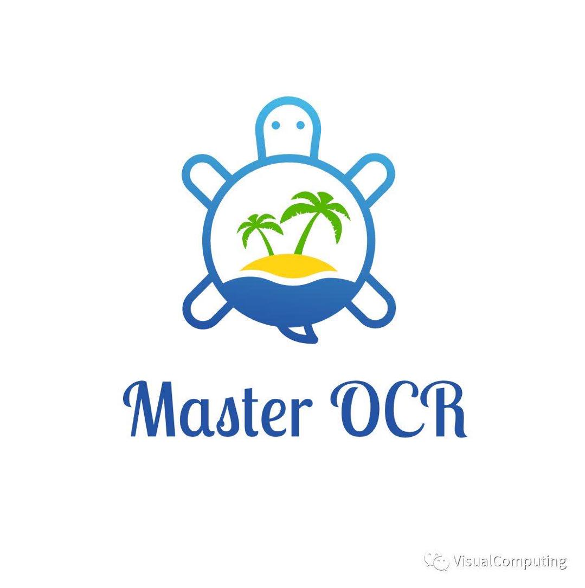

# MASTER-PyTorch  

<!--


-->

<div align=center>

</div>

PyTorch reimplementation of ["MASTER: Multi-Aspect Non-local Network for Scene Text Recognition"](https://arxiv.org/abs/1910.02562) 
(Pattern Recognition 2021). This project is different from our original implementation that builds on the privacy codebase FastOCR of the company.
You can also find Tensorflow reimplementation at [MASTER-TF](https://github.com/jiangxiluning/MASTER-TF) repository,
and the performance is almost identical. (PS. Logo inspired by the Master Oogway in Kung Fu Panda)


## News
* 2021/07: [MASTER-mmocr](https://github.com/JiaquanYe/MASTER-mmocr), reimplementation of MASTER by mmocr. [@Jiaquan Ye](https://github.com/JiaquanYe)
* 2021/07: [TableMASTER-mmocr](https://github.com/JiaquanYe/TableMASTER-mmocr), 2nd solution of ICDAR 2021 Competition on Scientific Literature Parsing Task B based on MASTER. [@Jiaquan Ye](https://github.com/JiaquanYe)
* 2021/07: Talk can be found at [here](https://www.bilibili.com/video/BV1T44y1m7vc) (Chinese).
* 2021/05: [Savior](https://github.com/novioleo/Savior), which aims to provide a simple, lightweight, fast integrated, pipelined deployment framework for RPA,
is now integrated MASTER for captcha recognition. [@Tao Luo](https://github.com/novioleo)
* 2021/04: Slides can be found at [here](https://github.com/wenwenyu/MASTER-pytorch/blob/main/assets/MASTER.pdf).

## Honors based on MASTER
* 1st place (2021/05) solution to [ICDAR 2021 Competition on Scientific Table Image Recognition to LaTeX (Subtask I: Table structure reconstruction)](https://competitions.codalab.org/competitions/26979)
* 1st place (2021/05) solution to [ICDAR 2021 Competition on Scientific Table Image Recognition to LaTeX (Subtask II: Table content reconstruction)](https://competitions.codalab.org/competitions/26979)
* 2nd place (2021/05) solution to [ICDAR 2021 Competition on Scientific Literature Parsing Task B: Table recognition](https://icdar2021.org/program-2/competitions/competition-on-scientific-literature-parsing/)
* 1st place (2020/10) solution to [ICDAR 2019 Robust Reading Challenge on Reading Chinese Text on Signboard (task2)](https://rrc.cvc.uab.es/?ch=12&com=evaluation&task=2)
* 2nd and 5th places (2020/10) in [The 5th China Innovation Challenge on Handwritten Mathematical Expression Recognition](https://www.heywhale.com/home/competition/5f703ac023f41e002c3ed5e4/content/6)
* 4th place (2019/08) of [ICDAR 2017 Robust Reading Challenge on COCO-Text (task2)](https://rrc.cvc.uab.es/?ch=5&com=evaluation&task=2)
* More will be released

## Contents
* [Introduction](#introduction)
* [Requirements](#requirements)
* [Usage](#usage)
	* [Prepare Datasets](#prepare-datasets)
	* [Distributed training with config files](#distributed-training-with-config-files)
	* [Using Multiple Node](#using-multiple-node)
	* [Debug mode on one GPU/CPU training with config files](#debug-mode-on-one-gpucpu-training-with-config-files)
	* [Resuming from checkpoints](#resuming-from-checkpoints)
	* [Finetune from checkpoints](#finetune-from-checkpoints)
	* [Testing from checkpoints](#testing-from-checkpoints)
	* [Evaluation](#evaluation)
* [Customization](#customization)
	* [Checkpoints](#checkpoints)
	* [Tensorboard Visualization](#tensorboard-visualization)
* [TODO](#todo)
* [Citations](#citations)
* [License](#license)
* [Acknowledgements](#acknowledgements)

## Introduction
MASTER is a self-attention based scene text recognizer that (1) not only encodes the input-output attention, 
but also learns self-attention which encodes feature-feature and target-target relationships inside the encoder 
and decoder and (2) learns a more powerful and robust intermediate representation to spatial distortion and 
(3) owns a better training and evaluation efficiency. Overall architecture shown follows.

<div align=center>

</div>

## Requirements
* python==3.6
* torchvision==0.6.1
* pandas==1.0.5
* torch==1.5.1
* numpy==1.16.4
* tqdm==4.47.0
* Distance==0.1.3 
* Pillow==7.2.0
```bash
pip install -r requirements.txt
```

## Usage

### Prepare Datasets
1. Prepare the correct format of files as provided in `data` folder.
	* Please see [data/README.md](data/README.md) an instruction how to prepare the data in required format for MASTER.
	* Synthetic image datasets: [SynthText (Synth800k)](https://www.robots.ox.ac.uk/~vgg/data/scenetext/), 
	  [MJSynth (Synth90k)](https://www.robots.ox.ac.uk/~vgg/data/text/), [SynthAdd (password:627x)](https://pan.baidu.com/s/1uV0LtoNmcxbO-0YA7Ch4dg)
	* Real image datasets: [IIIT5K](http://cvit.iiit.ac.in/projects/SceneTextUnderstanding/IIIT5K.html), [SVT](http://www.iapr-tc11.org/dataset/SVT/svt.zip), 
	[IC03](http://iapr-tc11.org/mediawiki/index.php?title=ICDAR_2003_Robust_Reading_Competitions), 
	[IC13](http://rrc.cvc.uab.es/?ch=2), [IC15](https://rrc.cvc.uab.es/?ch=4), [COCO-Text](https://rrc.cvc.uab.es/?ch=5), 
	  [SVTP](https://github.com/Jyouhou/SceneTextPapers/raw/master/datasets/svt-p.zip),
	  [CUTE80_Cropped](https://github.com/ocr-algorithm-and-data/CUTE80)
	* An example of cropping SynthText can be found at [data_utils/crop_synthtext.py](data_utils/crop_synthtext.py)
2. Modify `train_dataset` and  `val_dataset` args in `config.json` file, including `txt_file`,
   `img_root`, `img_w`, `img_h`.
3. Modify `keys.txt` in `utils/keys.txt` file if needed according to the vocabulary of your dataset.
4. Modify `STRING_MAX_LEN` in `utils/label_util.py` file if needed according to the text length of your dataset.

### Distributed training with config files
Modify the configurations in `configs/config.json` and `dist_train.sh` files, then run:
```bash
bash dist_train.sh
```
The application will be launched via `launch.py` on a 4 GPU node with one process per GPU (recommend).

This is equivalent to
```bash
python -m torch.distributed.launch --nnodes=1 --node_rank=0 --nproc_per_node=4 \
--master_addr=127.0.0.1 --master_port=5555 \
train.py -c configs/config.json -d 1,2,3,4 --local_world_size 4
```
and is equivalent to specify indices of available GPUs by `CUDA_VISIBLE_DEVICES` instead of `-d` args
```bash
CUDA_VISIBLE_DEVICES=1,2,3,4 python -m torch.distributed.launch --nnodes=1 --node_rank=0 --nproc_per_node=4 \
--master_addr=127.0.0.1 --master_port=5555 \
train.py -c configs/config.json --local_world_size 4
```
Similarly, it can be launched with a single process that spans all 4 GPUs (if node has 4 available GPUs) 
using (don't recommend):
```bash
CUDA_VISIBLE_DEVICES=1,2,3,4 python -m torch.distributed.launch --nnodes=1 --node_rank=0 --nproc_per_node=1 \
--master_addr=127.0.0.1 --master_port=5555 \
train.py -c configs/config.json --local_world_size 1
```
### Using Multiple Node
You can enable multi-node multi-GPU training by setting `nnodes` and `node_rank` args of the commandline line on every node.
e.g., 2 nodes 4 gpus run as follows
  
  Node 1, ip: 192.168.0.10, then run on node 1 as follows
  ```
CUDA_VISIBLE_DEVICES=1,2,3,4 python -m torch.distributed.launch --nnodes=2 --node_rank=0 --nproc_per_node=4 \
--master_addr=192.168.0.10 --master_port=5555 \
train.py -c configs/config.json --local_world_size 4  
```
   Node 2, ip: 192.168.0.15, then run on node 2 as follows
  ```
CUDA_VISIBLE_DEVICES=2,4,6,7 python -m torch.distributed.launch --nnodes=2 --node_rank=1 --nproc_per_node=4 \
--master_addr=192.168.0.10 --master_port=5555 \
train.py -c configs/config.json --local_world_size 4  
```
 
### Debug mode on one GPU/CPU training with config files
This option of training mode can debug code without distributed way. `-dist` must set to `false` to 
turn off distributed mode. `-d` specify which one gpu will be used.
```bash
python train.py -c configs/config.json -d 1 -dist false
```

### Resuming from checkpoints
You can resume from a previously saved checkpoint by:

  ```
  python -m torch.distributed.launch --nnodes=1 --node_rank=0 --nproc_per_node=4 \
--master_addr=127.0.0.1 --master_port=5555 \
train.py -d 1,2,3,4 --local_world_size 4 --resume path/to/checkpoint
  ```

### Finetune from checkpoints
You can finetune from a previously saved checkpoint by:

  ```
  python -m torch.distributed.launch --nnodes=1 --node_rank=0 --nproc_per_node=4 \
--master_addr=127.0.0.1 --master_port=5555 \
train.py -d 1,2,3,4 --local_world_size 4 --resume path/to/checkpoint --finetune true
  ``` 
  
### Testing from checkpoints
You can predict from a previously saved checkpoint by:

  ```
  python test.py --checkpoint path/to/checkpoint --img_folder path/to/img_folder \
                 --width 160 --height 48 \
                 --output_folder path/to/output_folder \
                 --gpu 0 --batch_size 64
  ```
**Note**: `width` and `height` must be the same as the settings used during training.

### Evaluation
Evaluate squence accuracy and edit distance accuracy:
  ```
python utils/calculate_metrics.py --predict-path predict_result.json --label-path label.txt

  ```
**Note**: `label.txt`: multi-line, every line containing `{ImageFile:<ImageFile>, Label:<TextLabel>}`

## Customization

### Checkpoints
You can specify the name of the training session in `config.json` files:
  ```json
  "name": "MASTER_Default",
  "run_id": "example"
  ```

The checkpoints will be saved in `save_dir/name/run_id_timestamp/checkpoint_epoch_n`, with timestamp in mmdd_HHMMSS format.

A copy of `config.json` file will be saved in the same folder.

**Note**: checkpoints contain:
  ```python
  {
    'arch': arch,
    'epoch': epoch,
    'model_state_dict': self.model.state_dict(),
    'optimizer': self.optimizer.state_dict(),
    'monitor_best': self.monitor_best,
    'config': self.config
  }
  ```

### Tensorboard Visualization
This project supports Tensorboard visualization by using either  `torch.utils.tensorboard` or [TensorboardX](https://github.com/lanpa/tensorboardX).

1. **Install**

   If you are using pytorch 1.1 or higher, install tensorboard by 'pip install tensorboard>=1.14.0'.

   Otherwise, you should install tensorboardx. Follow installation guide in [TensorboardX](https://github.com/lanpa/tensorboardX).

2. **Run training**

   Make sure that `tensorboard` option in the config file is turned on.

    ```
     "tensorboard" : true
    ```

3. **Open Tensorboard server**

   Type `tensorboard --logdir saved/log/` at the project root, then server will open at `http://localhost:6006`

By default, values of loss  will be logged. If you need more visualizations, use `add_scalar('tag', data)`, `add_image('tag', image)`, etc in the `trainer._train_epoch` method.
`add_something()` methods in this project are basically wrappers for those of `tensorboardX.SummaryWriter` and `torch.utils.tensorboard.SummaryWriter` modules.

**Note**: You don't have to specify current steps, since `WriterTensorboard` class defined at `logger/visualization.py` will track current steps.

## TODO
- [ ] Memory-Cache based Inference

## Citations
If you find MASTER useful please cite our [paper](https://arxiv.org/abs/1910.02562):
```bibtex
@article{Lu2021MASTER,
  title={{MASTER}: Multi-Aspect Non-local Network for Scene Text Recognition},
  author={Ning Lu and Wenwen Yu and Xianbiao Qi and Yihao Chen and Ping Gong and Rong Xiao and Xiang Bai},
  journal={Pattern Recognition},
  year={2021}
}
```

## License
This project is licensed under the MIT License. See LICENSE for more details.

## Acknowledgements
* [PICK-pytorch](https://github.com/wenwenyu/PICK-pytorch)
* [PyTorch Template Project](https://github.com/victoresque/pytorch-template)
